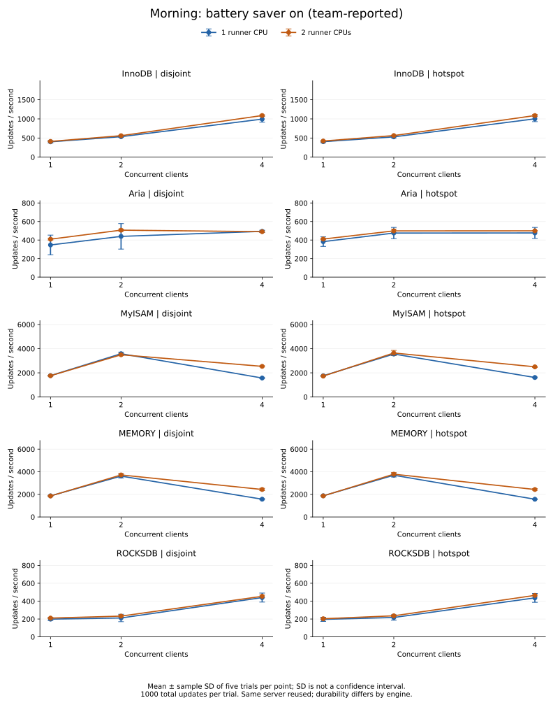
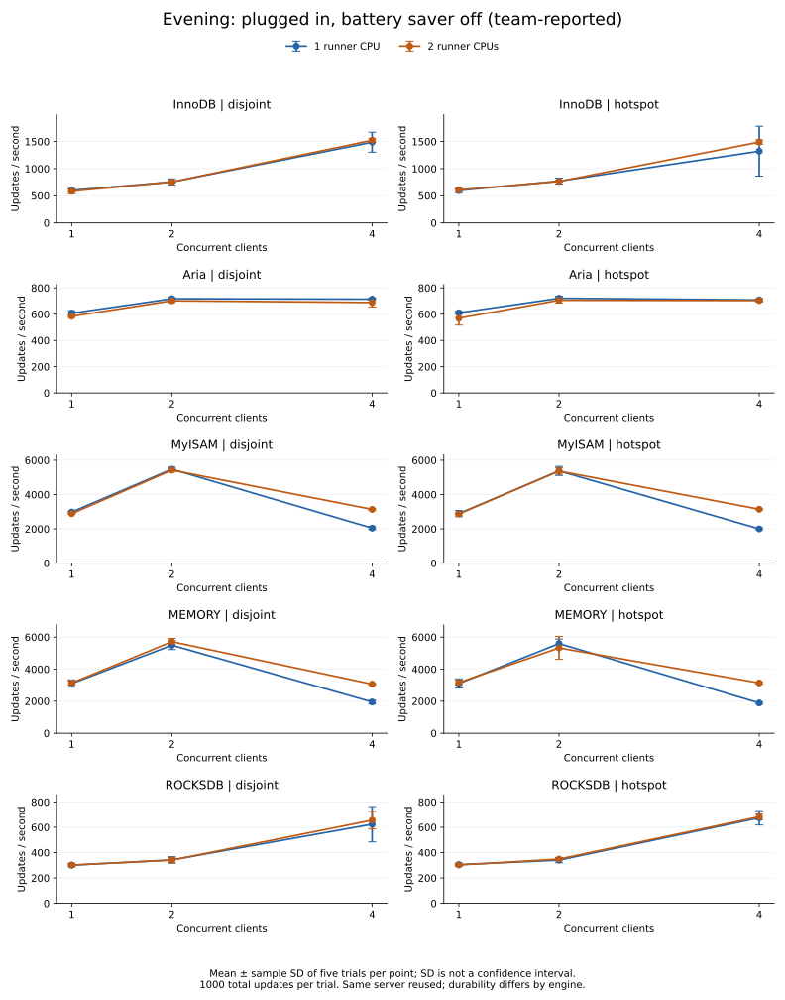

# CPU quota affects the measured four-client throughput

The runner's one-CPU bandwidth limit contributed to the observed MyISAM and MEMORY
slowdown in this harness. Increasing it to two CPUs improved four-client throughput
and removed recorded local runner throttling in both power-condition blocks.
Four clients still underperformed two on these engines after the change, so CPU quota
does not fully explain the scaling behaviour. These are client-observed measurements,
not isolated engine capacity or a durability-equivalent ranking.

## Runs and power conditions

Power conditions below were **reported by the team after running**, not automatically
measured. They must not be pooled as repetitions under identical conditions.

| Block | Order | Runner CPUs | Run ID |
| --- | --- | --- | --- |
| Morning: battery saver on | First | 1 | 20260929T082232Z-writes-75f6c965 |
| Morning: battery saver on | Second | 2 | 20260929T083304Z-writes-98fdb761 |
| Evening: plugged in, battery saver off | First | 2 | 20260929T162946Z-writes-18a13d6d |
| Evening: plugged in, battery saver off | Second | 1 | 20260929T164329Z-writes-17d5c81f |

Morning charging state and exact Windows power-plan settings were not captured.
The team confirmed the last two runs were performed plugged in with battery saver off.
The higher evening throughput is associated with changed power conditions, but those
runs do not isolate power mode from time, thermal conditions and background activity.
The reversed CPU order provides a second observation within another power block;
it is not a fully controlled four-run ABBA experiment at constant power settings.

Each run has 150 trials (five engines × two patterns × three client counts × five
rounds), with 1000 updates per trial and a verified final 10000-row dataset.
All four runs total 600 trials and 600000 timed updates. Within each block, recorded
workload, code fingerprints and database settings match; runner quota differs.
The same source fingerprints also match across the four runs.

## Main comparison: four clients, disjoint row partitions

| Block | Engine | 1 CPU updates/s | 2 CPUs updates/s | Relative increase |
| --- | --- | --- | --- | --- |
| Morning | MyISAM | 1571.64 | 2536.15 | 61.4% |
| Morning | MEMORY | 1570.68 | 2429.71 | 54.7% |
| Evening | MyISAM | 2042.99 | 3134.82 | 53.4% |
| Evening | MEMORY | 1949.71 | 3063.37 | 57.1% |

Values are means over five trials. Relative increase is the ratio of condition means,
not a paired-trial confidence interval. In both patterns and both blocks, all five
four-client MyISAM/MEMORY trials recorded runner throttling with one CPU and none
recorded it with two CPUs. The same direction of change appears for hotspot updates.

## Every engine and pattern

Points show five-trial means; error bars show sample standard deviation, **not confidence
intervals**. Each engine has its own vertical scale; the same engine uses the same scale
in both blocks. No trial has been removed, including the variable evening InnoDB
hotspot observations. Lines connect tested client counts; they do not predict untested counts.





See [all 120 condition summaries](cpu-measurements.md) for exact means, standard
deviations and throttled-trial counts. The [chart data and input hashes](figures/cpu-chart-data.json)
provide machine-readable provenance.

## What this tells a reader

- Before interpreting engine scalability, measure the load generator's own resource
  limits. Here, a runner configuration materially changed the reported throughput.
- For further experiments with this threaded harness, use two runner CPUs and keep
  reporting local throttling. That avoids the observed one-CPU constraint; it does
  not establish that the client is no longer a bottleneck.
- Keep laptop power settings fixed and recorded before each run. Preserve changes
  as separate experimental conditions, rather than silently combining results.
- Do not select an engine from these numbers alone. Storage, recovery, persistence,
  workload size and real-world data coverage remain incomplete.

## Limits and unresolved explanations

There are five within-run trials, not five independent machines. All use one reused
server; cache and MyRocks background activity can carry over. Runs use short fixed-work
bursts and threads in one Python process. Remaining losses at four clients could involve
client scheduling, server contention or other overhead. We did not measure server CPU,
server lock waits, network timing or Python scheduling directly, so cannot attribute the
remaining loss to any one of them. Higher throughput is not proof of stronger durability.

CPU counter windows include worker setup and teardown, whereas throughput excludes them.
Local cgroup counters cannot rule out host or ancestor-cgroup contention. See the
[diagnostic method](cpu-diagnostic.md) and [write method](concurrency-method.md).

## Evidence and reproduction

The [four original raw runs](../evidence/cpu-comparison/) were committed by the team
in `0e681adf80def4e71e4a5932590279e9baaf235f`. Their Git blob hashes match the uploaded
files used for review. Offline checks verified final-data checksums, timing counts,
trial order, throughput arithmetic, CPU-counter deltas, source fingerprints (accounting
for Windows CRLF) and exact summary regeneration. The assistant did not independently
rerun the database experiment. No raw result is modified by report generation.

To regenerate the figures and detailed table locally, without running MariaDB:

```powershell
python -m venv .venv-report
.\.venv-report\Scripts\python.exe -m pip install -r requirements-report.txt
.\.venv-report\Scripts\python.exe scripts/report_cpu.py
```

Charts were generated with Matplotlib 3.10.8. The optional reporting requirement pins
that direct dependency; transitive plotting dependencies are not fully locked. On Linux,
use `.venv-report/bin/python` instead. Report generation validates the complete trial
matrix, saved summaries, throughput arithmetic and within-block settings before drawing.
