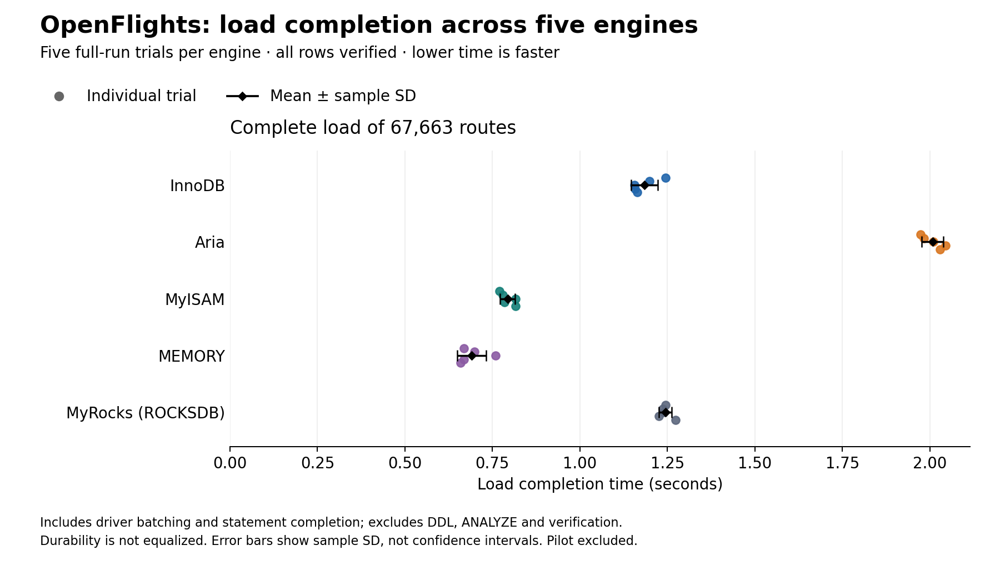
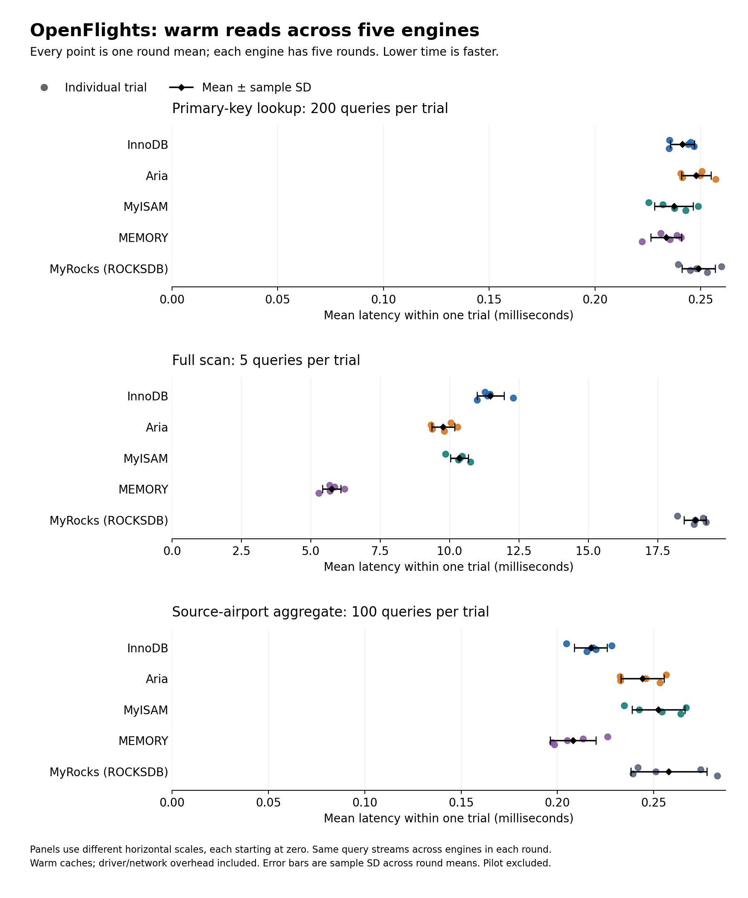

# OpenFlights findings: real route data across five engines

**Verified full run:** `20261009T160813Z-openflights-6884f225` (October 9, 2026), five balanced rounds across five engines.
Each of the 25 trials loaded and checked all **67,663 routes**: 1,691,575 verified row loads.
The separate five-trial pilot `20261009T152651Z-openflights-b44366ef` is validated but excluded from these statistics and charts.

## What the measurements show

- MEMORY had the lowest observed mean load and full-scan times. This supports considering
  it for rebuildable reference-data work where the table fits in memory. The separate
  [recovery experiment](recovery-findings.md) found complete row loss after both clean and
  forced restarts; it cannot be the sole persistent copy of this route dataset.
- Among the four disk-backed engines in this run, MyISAM had the lowest mean load time,
  while Aria had the lowest mean full-scan time. The results show that the fastest loader
  was not also the fastest scanner within that group.
- MyRocks had the highest mean full-scan time here. These small, warm, single-client trials
  do not test its sustained-ingestion or large-dataset behavior, nor equal storage budgets.
- Point-lookup means were close (about 0.234–0.249 ms), with overlapping observed ranges.
  Do not turn those small differences into a general ranking. Source-query timing includes
  variable result cardinality and client overhead; it is not pure index-traversal latency.





## Complete full-run summary

Values are **mean ± sample standard deviation across five trials**. Read measurements first
average queries within each trial. Neither individual queries nor rows are independent repeats.

| Engine | Load (s) | Point lookup (ms) | Full scan (ms) | Source aggregate (ms) |
| --- | ---: | ---: | ---: | ---: |
| InnoDB | 1.1840 ± 0.0383 | 0.2413 ± 0.0057 | 11.4745 ± 0.4860 | 0.2173 ± 0.0085 |
| Aria | 2.0078 ± 0.0305 | 0.2479 ± 0.0069 | 9.7694 ± 0.4150 | 0.2441 ± 0.0112 |
| MyISAM | 0.7932 ± 0.0213 | 0.2374 ± 0.0091 | 10.3507 ± 0.3222 | 0.2524 ± 0.0137 |
| MEMORY | 0.6906 ± 0.0410 | 0.2337 ± 0.0073 | 5.7458 ± 0.3325 | 0.2080 ± 0.0119 |
| ROCKSDB | 1.2440 ± 0.0182 | 0.2491 ± 0.0079 | 18.8477 ± 0.3985 | 0.2578 ± 0.0197 |

Every round appears as a point in the figures; SD bars are descriptive spread, not confidence
intervals. [Per-trial derived data](data/openflights-observations.csv) preserves all 25 observations;
[statistics](data/openflights-statistics.json) includes medians, minima, maxima and provenance.
The archived JSON preserves all individual query samples. No significance test or universal winner
is claimed from five rounds on one host.

## Correctness, plans and conditions

All 25 trials matched canonical dataset SHA-256
`ea46aabb9533882cf36baa761b285ef8f8829915ff1b3a689fc8315206532441`.
The scan oracle was `(67663, 11, 305336)`: row count, total stops and equipment character count.
The source file, transformation, missing IDs and nonunique route combinations are documented
in the [method](openflights-method.md). This is OpenFlights route reference data, not synthetic
flight events or a current operating schedule. Data attribution: [OpenFlights](https://openflights.org/data.html),
via MariaDB/openflights; [ODbL 1.0](../data/openflights/LICENSE).

The recorded EXPLAIN samples in every trial used PRIMARY for point lookups,
source_destination for source aggregates, and ALL for full scans. Plans were captured for
the first lookup/source key, not every possible key. ANALYZE returned OK for the four disk-backed
engines; MEMORY reported that ANALYZE is unsupported. Its rows and answers were still verified.
Actual logical schemas matched apart from the engine and Aria's reported PAGE_CHECKSUM option.

The five full-run rounds placed each engine once in each position. Recorded conditions:

- MariaDB 11.8.9-MariaDB-ubu2404, Python 3.12.15, PyMySQL 1.1.2, WSL2 Linux containers.
- Power condition: `plugged in; battery saver off`. See the [same-day hardware record](benchmark-environment.md).
- Runner runtime reported a one-CPU cgroup quota and 512 MiB limit; the recorded Compose
  source configures DB quota 2 CPUs / 2 GiB. Quotas are not dedicated cores.
- Query cache OFF, strict/no-substitution mode, autocommit ON, session MEMORY maximum 128 MiB.
- Pilot and full run recorded identical source hashes, runtime, server version and selected
  global/session settings. This does not establish identical host background load or cache state.

The dataset was fully read for verification before timed queries, followed by explicit warmups.
Load excludes DDL, ANALYZE and verification. Query times include execute/fetch and driver/network
overhead; answer comparison is outside the timer. The server/volume is reused, and engine caches,
durability settings and background work are not equalized. No cold-cache, physical-disk,
compression, sustained-compaction or concurrent-workload conclusion follows from this run.

## Interpreting the trade-offs

Engine design informs what to investigate; it does not by itself prove why a timing differs.
[MariaDB's engine guide](https://mariadb.com/docs/server/server-usage/storage-engines/choosing-the-right-storage-engine)
describes MEMORY's in-memory, volatile role and InnoDB's transactional role.
[InnoDB](https://mariadb.com/docs/server/server-usage/storage-engines/innodb/innodb-storage-engine-introduction)
provides transactions and row-level locking;
[MyISAM](https://mariadb.com/docs/server/server-usage/storage-engines/myisam-storage-engine/myisam-overview)
uses table-level locking. This single-client read test does not measure their contention costs.
[MyRocks uses LSM storage](https://mariadb.com/docs/server/server-usage/storage-engines/myrocks/about-myrocks-for-mariadb);
its full-scan result here does not establish the causal cost of LSM organization or compaction.

Practical interpretation: benchmark MEMORY for disposable cached route data; assess persistent
engines against both load/read needs and required guarantees. MyISAM's loading result does not
erase the crashed-table warnings in our separate recovery evidence. If transactions are required,
do not choose from this speed table alone. Final recommendations must combine this report with
the [storage](storage-findings.md), [CPU/concurrency](cpu-findings.md) and
[recovery](recovery-findings.md) evidence and each experiment's limitations.

## Evidence and reproduction

- [Full raw results](../evidence/openflights/20261009T160813Z-openflights-6884f225/results.json) and [original summary](../evidence/openflights/20261009T160813Z-openflights-6884f225/summary.md).
- [Pilot raw results](../evidence/openflights/20261009T152651Z-openflights-b44366ef/results.json), kept separate.
- [Dataset pin](../data/openflights/manifest.json), [method](openflights-method.md),
  [trial CSV](data/openflights-observations.csv), [statistics/provenance](data/openflights-statistics.json).

Charts and this report are committed; viewing them requires no new experiment. Optional regeneration
on the host uses Matplotlib 3.10.8 and the checksum-verified source dataset:

```powershell
python scripts/fetch_openflights.py
python -m pip install matplotlib==3.10.8
python scripts/report_openflights_findings.py
```

The generator validates both archived runs, checksums, query streams, result cardinalities, schemas,
plans, sample counts, statistics and original summaries. It refuses incomplete or internally inconsistent evidence.
Canonical JSON hashes in the provenance ignore Git/OS line-ending conversion. Source hashes remain
as captured during the experiments; no historical provenance is rewritten. No Docker command is run.
