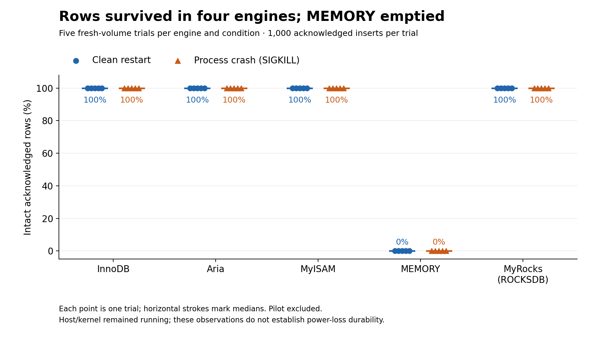
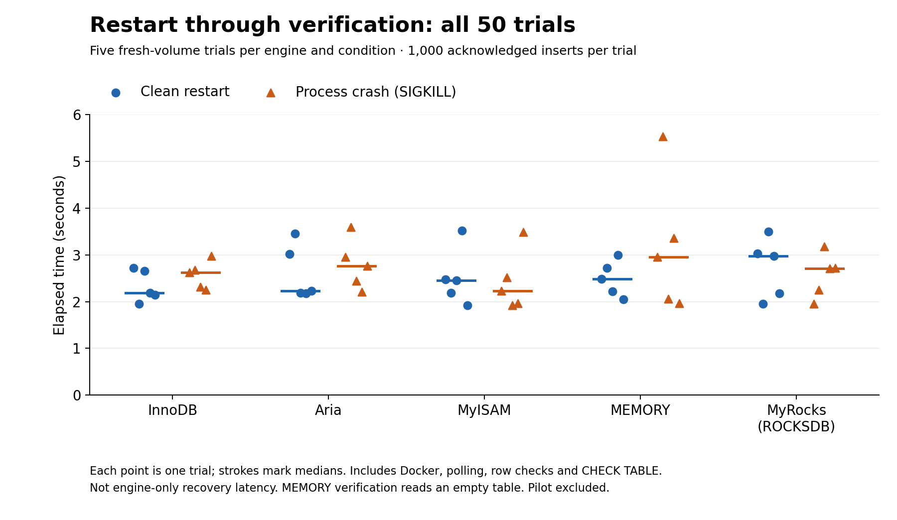

# Recovery findings: acknowledged rows after process restart

**Verified scope:** full run `20261006T161514Z-recovery-99656d7e`, October 6, 2026; 50 fresh-volume trials,
five per engine and stop condition, 1,000 acknowledged single-row autocommit inserts per trial.
The separate 10-trial pilot `20261006T155703Z-recovery-adbea5ba` is validated but excluded from the full-run charts and statistics.

## Findings

- InnoDB, Aria, MyISAM and MyRocks returned all 1,000 rows unchanged in every clean and forced restart trial.
- MEMORY returned an empty table after all ten restarts, including the five clean controls.
  This observed volatility matters when choosing an engine for data that must survive restarts.
- All five MyISAM forced-restart logs flagged the benchmark table as crashed and needing repair.
  A subsequent full read matched every row, and CHECK TABLE returned OK. The harness issued no
  manual REPAIR TABLE. These logs must accompany the survival result; intact rows alone do not
  establish a clean recovery path or transactional guarantees. The precise repair work is not quantified.
- All five Aria forced-restart logs recorded Aria recovery completion. The pilot showed the same
  row-survival pattern and corresponding MyISAM/Aria log signals (one trial per condition).
- No table was unreadable or unavailable, and no trial project required retention. All intended
  clean stops exited 0; all SIGKILL stops exited 137 without an OOM flag.



## Timing and complete full-run table



Timing spans Docker restart request through observer completion, including observer-container launch,
connection polling, full row comparison and CHECK TABLE. **It is not engine-only recovery latency.**
MEMORY verification reads zero rows, while the other engines read 1,000; timing is not equal-work
across engines. The chart shows every trial, with deterministic horizontal offsets for legibility.
Horizontal strokes are medians; the table gives observed ranges, not confidence intervals.

| Engine | Stop | Trials | Intact rows per trial | Median seconds | Min–max seconds | Crash-table warnings |
| --- | --- | ---: | ---: | ---: | ---: | ---: |
| InnoDB | clean | 5 | 1000 | 2.187 | 1.953–2.719 | 0 |
| InnoDB | sigkill | 5 | 1000 | 2.625 | 2.250–2.969 | 0 |
| Aria | clean | 5 | 1000 | 2.234 | 2.172–3.453 | 0 |
| Aria | sigkill | 5 | 1000 | 2.766 | 2.203–3.594 | 0 |
| MyISAM | clean | 5 | 1000 | 2.454 | 1.922–3.515 | 0 |
| MyISAM | sigkill | 5 | 1000 | 2.234 | 1.922–3.485 | 5 |
| MEMORY | clean | 5 | 0 | 2.485 | 2.047–3.000 | 0 |
| MEMORY | sigkill | 5 | 0 | 2.953 | 1.968–5.531 | 0 |
| ROCKSDB | clean | 5 | 1000 | 2.969 | 1.953–3.500 | 0 |
| ROCKSDB | sigkill | 5 | 1000 | 2.704 | 1.953–3.172 | 0 |

The statistical unit is one fresh-volume trial, not one inserted row. Five trials per condition
on one host are descriptive evidence, not an engine-speed ranking or a reliability probability.
Condition order is not perfectly balanced within each engine; host variation remains a confounder.

## Recorded conditions and limits

Power condition: `plugged in; battery saver off`. Server: MariaDB 11.8.9, x86_64;
Docker Desktop Linux containers on WSL2. Each run used one DB image ID and one runner image ID.
Image IDs, source hashes and canonical result hashes are in [derived statistics](data/recovery-statistics.json).
The canonical result hashes use sorted compact JSON to ignore Git/OS line-ending changes.
Restart log hashes verify the original bytes; `evidence/recovery/.gitattributes` disables log text conversion.

Recorded global settings include `innodb_flush_log_at_trx_commit=1`,
`rocksdb_flush_log_at_trx_commit=1`, `innodb_doublewrite=ON`, `log_bin=OFF`,
and `aria_recover_options=myisam_recover_options=BACKUP,QUICK`. Session autocommit was ON.
These are recorded conditions, not proof of equal durability across engines. Full per-trial
settings and actual table DDL remain in the acknowledgment receipts.

The server was stopped between statements after every insert was acknowledged. Its writer connection
remained open; receipt transfer and host orchestration introduced a delay before the stop.
SIGKILL left the host/kernel and filesystem cache running. This does not test power loss,
storage-device failure, interrupted statements, uncertain commit outcomes or open transactions.
The small synthetic dataset and this crash timing cannot establish general durability guarantees.
In particular, MyISAM's intact rows in this experiment do not establish transactional atomicity.

## Evidence and reproduction

- [Full raw results](../evidence/recovery/20261006T161514Z-recovery-99656d7e/results.json) and [original summary](../evidence/recovery/20261006T161514Z-recovery-99656d7e/summary.md).
- [Pilot raw results](../evidence/recovery/20261006T155703Z-recovery-adbea5ba/results.json) remain separate.
- [All full-run observations](data/recovery-observations.csv), [statistics and provenance](data/recovery-statistics.json).
- [Recovery protocol](recovery-method.md) documents isolation, acknowledgment handling and limitations.
- Example [MyISAM crash log](../evidence/recovery/20261006T161514Z-recovery-99656d7e/10-myisam-sigkill/restart.log)
  and [Aria crash log](../evidence/recovery/20261006T161514Z-recovery-99656d7e/07-aria-sigkill/restart.log).

The figures and report are committed; viewing them needs no database or plotting installation.
To regenerate from archived evidence on the host, install Matplotlib 3.10.8
in your chosen reporting environment, then run from the repository root:

```powershell
python -m pip install matplotlib==3.10.8
python scripts/report_recovery_findings.py
```

The generator checks both runs, complete schedules, receipt copies, expected row digests,
stop states and every restart-log checksum before reporting. It fails on changed or unknown
outcomes rather than counting them as zero survival. It does not start Docker or rerun experiments.
PNG and SVG versions are emitted; Matplotlib/font/platform differences may affect rendering.
