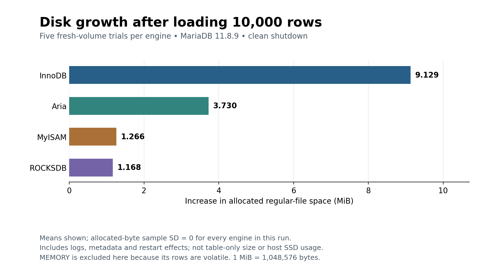
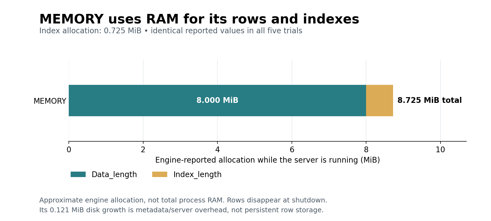

# Storage findings

**The full run completed 25 verified trials: 10,000 identical rows per trial, five trials per engine.**
Allocated datadir growth was identical across repeats for each engine. These results describe this workload and shutdown procedure, not a general storage-efficiency ranking.



## Recorded results

| Engine | Trials | Mean allocated growth (bytes) | Mean growth (MiB) | Sample SD (bytes) |
| --- | ---: | ---: | ---: | ---: |
| InnoDB | 5 | 9,572,352 | 9.129 | 0 |
| Aria | 5 | 3,911,680 | 3.730 | 0 |
| MyISAM | 5 | 1,327,104 | 1.266 | 0 |
| ROCKSDB | 5 | 1,224,704 | 1.168 | 0 |
| MEMORY (overhead only) | 5 | 126,976 | 0.121 | 0 |

The initialized empty-database baseline was 156,749,824 allocated bytes in every trial. Growth is the signed difference between the stopped-server inventories before and after loading. It covers regular files across the entire datadir, including logs and metadata. One MiB is 1,048,576 bytes.

## What the measurements support

- In this run, ROCKSDB had the smallest datadir growth among the four persistent engines, followed by MyISAM, Aria and InnoDB. This ordering includes engine and server overhead.
- Allocation did not vary across the five trials at the filesystem block resolution. Apparent file lengths did vary slightly. Zero observed sample SD does not imply zero uncertainty or universal repeatability.
- File inventories help explain the totals: the InnoDB `.ibd` file occupied 9,441,280 allocated bytes in each trial; Aria also grew its log. These are observations of this run, not general requirements of those engines.



MEMORY reported 8,388,576 data bytes and 760,000 index bytes before shutdown (8.725 MiB combined). This is approximate engine allocation, not total server RAM. Its disk growth does not represent persistent copies of its rows.

ROCKSDB reported zero for live `Data_length` and `Index_length`, despite nonzero disk allocation and recorded SST files. Do not interpret those live statistics as zero storage use. The report therefore uses filesystem measurements for the disk comparison.

## Method and limits

- Full run: `20261006T120404Z-storage-a5d23142`; MariaDB 11.8.9; `plugged in; battery saver off`.
- Each trial used a fresh isolated volume. Engine order was balanced across five rounds. All trials shared the same laptop.
- Every loaded row was checked against the generated data before shutdown. Recorded checksums matched across all 25 trials; 50 clean shutdown records and all inventory sums/deltas were checked.
- Measurements include table creation, loading, validation, ANALYZE, and a second startup/shutdown cycle. There was no separate empty-workload control to subtract restart effects.
- MyRocks was not forced into fully compacted steady state. No compression ratio, crash durability equivalence or Windows VHDX/physical SSD size is inferred.
- This uses only 10,000 synthetic rows with the supplied schema/indexes. It does not establish behavior for other data sizes, distributions or long-lived databases.
- The separate pilot was used to validate the procedure and is excluded from these averages.

## Evidence and reproduction

- [Full raw results](../evidence/storage/20261006T120404Z-storage-a5d23142/results.json) and [original summary](../evidence/storage/20261006T120404Z-storage-a5d23142/summary.md).
- [All 25 observations](data/storage-observations.csv), [statistics and provenance](data/storage-statistics.json), and [experiment method](storage-method.md).
- The existing experiment dependencies are unchanged. Regenerating figures additionally requires Matplotlib; viewing the PNG/SVG files needs no installation.
- From the project root, with Matplotlib installed:

```powershell
python scripts/report_storage_findings.py
```

This regenerates the report, charts and derived data without rerunning MariaDB.
